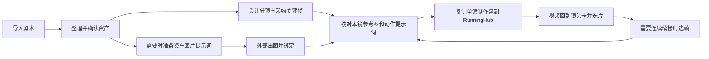

# Drama Skills 接入评估与实施计划

2026-09-12 范围更新：当前源码 0.8.0，DS01 工程已实现。用户确认重点融合生成段，不加入参考片研究，见 [生成段融合计划](generation-segments-plan.md)。后续 DS02–DS04／DS06 按 GS 切片细化；下文“单镜制作包／视频直接归单镜”的表述扩展为“生成段制作包／尝试导回并按镜头选片”，单镜是特例。以下原始日期、授权和切片说明保留历史背景，当前状态以 [TODO](TODO.md) 为准。

日期：2026-09-12。状态：**规划完成，尚未实施接入**。本次授权是评估与制定计划，不包含插件升级、安装上游 Skill、真实模型调用或媒体生成。执行进度统一维护在 [TODO](TODO.md)。

## 1. 决策与目标

建议将 Drama Skills 的四项制作能力逐步适配为 ObCanvas 内可选择的文字规则：资产整理、资产图片提示词、分镜与关键帧、视频提示词。先验证价值最高的“分镜与关键帧”，利用现有资产和参考图完成一个小范围闭环，再扩展其余能力。

成功的标准是：用户拿着已有剧本，在中文画布中看懂**为什么这样拍、用什么景别、需要哪张图、下一步生成什么**；减少手工重写与工具间重复整理。Skill 文件数量和新增按钮数量不作为成果。

上游规则与用户困扰匹配，但“有相关规则”不等于“已验证能稳定产出好分镜”。DS01 的本地适配、结构检查和隔离 Obsidian 宿主验收已经完成；真实模型对照与 H3 生成尚未运行。后续继续分别记录结构正确、创作质量、宿主可用性和实际生成效果。

### 三种接法的取舍

| 方案 | 收益 | 代价 | 判断 |
| --- | --- | --- | --- |
| 整套 Dashboard、Python 工具、生产模块嵌入 | 上游能力最多 | 两套界面、文件规范、状态与升级链；改变 RunningHub 分工 | 不采用 |
| 在外部 Agent 运行上游，再导入其整集 Markdown | 可保留上游原生工作方式 | 用户继续切换工具；还需可靠的双向格式转换 | 留作未来导入需求，不是首版主流程 |
| 按阶段适配选中的文字规则，接现有模型与 Vault 保存层 | 保留中文画布，直接改善镜头决策；范围可控 | 需编写阶段输出契约、字段映射与确认界面 | **采用此方向，先小样验证** |

Drama Skills 是规则、参考资料和工具的合集，不是可以直接调用的文字模型 API。ObCanvas 当前也不是完整 Agent CLI：现有 `ChatClient` 只发送文字消息，不提供文件工具、图片理解或递归调用其他 Skill。接入方案以这一事实为起点。

## 2. 评估依据与项目价值

### 固定版本

- 上游：[zenstory-ai/drama-skills](https://github.com/zenstory-ai/drama-skills)。
- 本次检出的提交：`4c40ca6101648579b2455d0c0d890ce701f05173`，提交时间 `2026-09-11T10:02:56-07:00`。规划依据固定到该提交，不自动跟随 `main`。
- 本地 ObCanvas 基线：`e3da480`，`package.json` 为 `0.5.0`；检查开始时工作区干净。当前能力依据源码与既有验证记录，未在本轮重新验收正式资料库。
- 上游共 11 个 Skill。本次候选四项仅 `SKILL.md` 与直属 `references/*.md` 就分别约 33,706、35,850、55,031、78,290 个字符。这是文件文本统计，不是 token 数或一次请求大小；不能全部拼进每次请求。
- 上游 [MIT 许可证](https://github.com/zenstory-ai/drama-skills/blob/4c40ca6101648579b2455d0c0d890ce701f05173/LICENSE) 允许按其条款使用、修改和分发；实际复用须保留原版权与完整许可，记录修改来源。

### 价值与缺口

| 用户问题 | 已读的上游依据 | 接入价值 | 仍须由我们解决 |
| --- | --- | --- | --- |
| 不知道该用特写还是其他景别 | [镜头设计方法](https://github.com/zenstory-ai/drama-skills/blob/4c40ca6101648579b2455d0c0d890ce701f05173/skills/short-drama-storyboard/references/shot-craft.md) | 先确定观众需要读到的信息，再决定距离、视角、固定或移动；要求切镜有理由 | 把理由做成可读中文字段，并验证模型不是只套用术语 |
| 关键帧和动作提示词混在一起 | [关键帧方法](https://github.com/zenstory-ai/drama-skills/blob/4c40ca6101648579b2455d0c0d890ce701f05173/skills/short-drama-storyboard/references/keyframe-craft.md) | 分开起始瞬间、结束状态与镜内过程 | 分开保存、编辑与复制；证明首帧没有提前出现结尾动作 |
| 图片不知道该关联哪一镜 | [分镜 Skill](https://github.com/zenstory-ai/drama-skills/blob/4c40ca6101648579b2455d0c0d890ce701f05173/skills/short-drama-storyboard/SKILL.md) | 区分资产事实、图片提示词条目、真实参考图和外部挂图计划 | 将引用转成真实卡片/媒体关系；文字模型不能自动确认图片内容 |
| 换装、道具状态容易乱 | [身份与变体](https://github.com/zenstory-ai/drama-skills/blob/4c40ca6101648579b2455d0c0d890ce701f05173/skills/short-drama-assets/references/identity-vs-variant.md) | 同一身份复用，持续状态单独表达，瞬时姿势交给镜头 | 当前资产模型没有正式变体字段，需后续有范围的扩展 |
| 每次都要重写 H3 提示词 | [H3 规则](https://github.com/zenstory-ai/drama-skills/blob/4c40ca6101648579b2455d0c0d890ce701f05173/skills/short-drama-video-prompts/references/minimax-h3.md) | 已有参考图用途、顺序、主体标签和不同输入模式的表达方法 | 按实际 RunningHub 输入方式核对，防止两次提示词增强或输入槽位对不上 |
| 视频有了，不知道是否能续接 | [起止状态与摄影连续性](https://github.com/zenstory-ai/drama-skills/blob/4c40ca6101648579b2455d0c0d890ce701f05173/skills/short-drama-video-prompts/references/camera-audio-continuity.md) | 有助于描述相邻剧情状态 | 真实截图、采用区间、源视频变化和受影响镜头，仍是 ObCanvas 的 R4 工作 |

这套规则最适合剧情短片/短剧生产。它含有竖屏、快节奏、动态漫等默认取向，不能直接当作所有电影和 MV 的风格。上游把部分做法标成 `craft_default` 或 `taste_option`，适配时应保留这种可调整性，而非全部变成强制检查。

上游 [公开示例](https://github.com/zenstory-ai/drama-skills/tree/4c40ca6101648579b2455d0c0d890ce701f05173/examples/creator-first) 声明未提供实际参考图片、选择文生视频；其 README 也说明它不是格式 schema。它可以帮助理解交付内容，不能证明我们的 H3 参考生视频链路已经可用。部分 Python 自检仍读取 JSON/JSONL 夹具，与当前五份 Markdown 的创作表面不同；不整包移植校验器。

## 3. 产品分工与实际操作

资产图片提示词与分镜是两条可以独立推进的分支。用户已有图就直接关联，不要求重做全套资产图；分镜草案也不必等所有图片生成完。信息缺失只影响依赖该信息的镜头，不把整个项目锁死。

| 用户所处位置 | 动作 | 应看到的结果 |
| --- | --- | --- |
| 剧本卡 | 选择本次范围、制作方式，点击“设计分镜” | 侧栏内的可编辑镜头建议；原文依据、拍摄理由、景别机位、起始画面、结束状态 |
| 分镜建议 | 检查、修改、保留或忽略后应用 | 对应镜头卡与剧本/资产关系；原有卡片位置和视频采用保留 |
| 镜头卡 | 点击“关键帧与参考图” | 静态关键帧提示词、真实图片、每张用途、还缺哪张；可指定在外部自行挂图 |
| 资产卡 | 需要时点击“准备图片提示词” | 该资产的图片文案与参考用途；不自动生成图片 |
| 镜头卡 | 点击“准备视频提示词” | 本镜完整文案、图像顺序、目标模式和生成时长；中文说明便于核对 |
| 镜头卡 | 复制/导出制作包，之后拖回视频 | 视频成为该镜候选，由用户决定采用或重做 |
| 采用视频 | 选择“用于续接”或“独立机位” | 需要时截取真实画面并指向目标镜头；不强制每个视频都截帧 |

主界面继续使用自由画布与按需侧栏。只在相应功能已经实现时显示可执行入口。每个镜头的默认阅读顺序是“拍什么 → 为什么这样拍 → 用什么图 → 复制什么 → 还缺什么”，不让用户填写内部 ID、Markdown 标题或 JSON。

### 让不同作品保留不同节奏

三类配置分开：

1. **阶段方法**：一次选择一个主 Skill，决定如何整理资产/设计分镜/编写提示词；保留项目默认和本次覆盖。
2. **作品方向**：画幅、表现形式、观看节奏与用户补充的风格说明。横屏实拍感、克制悬念、快节奏竖屏不互相冒充默认。字段可沿用已有输入，不要求每次重填。
3. **生成目标**：模型、参考模式、正文语言与经核对的执行限制。它约束可交付素材，不决定作品必须采用何种镜头语言。

首轮不制作导演名录或大批风格预设。内置方法可查看、复制为自定义；用户的自定义规则可以改变镜头取舍，不能改变来源事实、文件写入范围或返回格式。调换规则不自动重跑或覆盖已确认结果。

MV 暂不宣称已接入专用分镜能力。现有“音乐 MV 资产”继续可用；进入分镜需具备音乐段落/时间点与画面意图，并提供独立方法或经过验证的自定义方法。只有配乐功能不等于支持 MV 剪辑，缺少音频分析能力时不猜 BPM、歌词落点或自动打拍。

## 4. 必须适配的差异

### 4.1 只保留一套正式项目记录

本项目正式内容由 Vault 卡片笔记和现有 ID 关系维护。上游 `剧本.md`、`视觉设定.md`、`分镜.md`、`图片提示词.md`、`视频提示词.md` 的所有权划分值得复用，但不按其路径再建立一套可编辑主记录。

模型上下文由现有卡片组合成快照。任务草稿保存当时的输入、建议与应用进度，不是正式内容的第二写入源。需要交付 Markdown 时，从已确认卡片生成带时间/版本的导出快照，不做隐式双向同步。

### 4.2 文字规则包，而非通用 Agent 平台

首版由开发时审核的本地注册表打包方法与参考片段，继续通过现有 `ChatClient` 调用通用文字接口。宿主收集输入、选择知识、验证结果；模型不自行读文件或调工具。

- 入口支持 `assets`、`asset-image-prompts`、`storyboard`、`video-prompts` 四种明确阶段；按已完成切片逐个开放。
- 包记录 ID、中文名、本地版本、阶段、主规则、允许使用的参考片段、输出契约版本、适用形式、上游提交与来源清单。
- 每阶段有小型必读核心；复杂调度、信息延迟、特定模型等按明确任务选项加载补充。选择记录可回查，不让模型依赖未提供的相对链接。
- 分镜试点先复用 `shot-craft.md`、`keyframe-craft.md`、`scene-visual-plan.md` 中相关方法，按片段记录来源；完整 `production-shot-grammar.md` 中竖屏节奏等取向经过筛选再进入，不默认全部加载。
- 试点方法正文与加载片段合计先控制在现有 20,000 字符量级，输入另设上限并记录实际大小；这是工程初始预算，不等于 token 保证。超限应缩小本次范围或按已审定章节精简方法，不能静默截掉剧本、对白或规则尾部。
- 对上游的文件写入、其他 Skill 路由、默认语言、固定目录和文档输出要求写明确适配说明，并从运行规则中替换；不能把整篇原文与互相冲突的 JSON 要求简单拼接。
- 需要共享的参考角色/视觉方向知识时，只引入已审定文字片段，不安装整个 `short-drama` 调度器。上游命令、Python、网页和下载逻辑不随包执行。

保留 0.5.0 单 Markdown 自定义规则。首版只升级内置包与对应阶段的文字编辑，不同时开发任意 ZIP/GitHub 安装、Skill 市场和自动更新。未来如果有实际自定义多文件包需求，再单独设计导入边界。

### 4.3 图片绑定不能冒充图像理解

现有模型只收到文字。可用信息是用户已经确认的资产描述、图片用途、文件指纹与绑定关系。插件可以检查文件存在、指纹未变、顺序和用途有效；不能声称已识别图片中的脸、空间或造型。

- 基于已确认关系推荐图片，新增用途由用户在预览里检查；仅文件名相似不能自动绑定。
- 分开显示“图片已绑定”“用户已确认用途”“模型未分析图片内容”，后者只在可能误解时说明，不增加每次强制弹窗。
- 外部自行挂图是计划：记录所需图片及顺序，不伪造媒体路径，不显示“图片已准备”。它可以生成供用户手动挂图使用的文案。
- 未声明如何补图时，只给缺口和文案草稿；不静默改成文生视频。已明确外部挂图时无需重复索要文件。
- 关键帧的静态文字是镜头计划，真实起始图是媒体。两者分开存在，资产主参考不能自动当作镜头起始帧。

### 4.4 连续性与剪辑节奏

- **成片计划时长与生成素材时长分开。** 一个成片使用 1 秒的细节镜头，可以计划生成更长素材供选片；不把生成下限写成最低剪辑时长，也不要求用户保留无意义的停顿。
- 本轮只规划两类时长；实际采用入出点在 R4 根据视频登记。对白估时属于规划，生成后还要检查完整性。
- **剪辑相邻不一定表示剧情连续。** A 房间 → B 走廊 → A 房间，应分别跟踪两条空间/状态线；A2 的状态承接 A1，而不是把 B1 的终态套给 A2。参考续接来源必须显式指定。
- 同一机位连续动作、同一场景换机位、跨时空切换是不同关系。换机位可另做起始图，不能默认拿上一镜截图强行续接。
- 分镜记录起点、动作、终点；视频提示词不能重新决定这些边界。截取的是实际生成视频的画面；计划尾帧不能冒充实际截图。
- 镜头说明可引用上一镜；独立交给生成工具的文案必须带齐必要事实或真实输入参考，不能只写“与上一镜相同”。

## 5. 数据映射与保存设计

以下是总体数据设计。DS01 已增加独立分镜预览任务；正式镜头卡格式尚未变更，后续字段仍按对应切片实施，详见 [正式记录格式](record-format.md)。

| 上游概念 | 现有 ObCanvas | 拟定适配 |
| --- | --- | --- |
| 剧本场景与原文来源 | `script.body`、`sceneId` | 任务快照生成可定位原文片段，保存剧本 ID、内容哈希、原句与范围；不要求用户补 SC 编号 |
| SHOT 与镜头职责 | `shot.id`、`intent`、`framing`、`camera`、`body` | 沿用字段；新增草案到正式 ID 映射，不用模型输出的序号作正式身份 |
| 起止状态、声音、时间 | 目前无对应结构字段 | 在镜头笔记扩展有版本的制作信息，分别存起点/动作/终点、声音意图、计划剪辑时长和生成时长 |
| 人物/地点/道具依据 | `person/setting/prop` 与 `links` | 引用真实资产 ID；缺失信息记录未决建议，分镜阶段不顺便新建或改写资产 |
| Look/View/State | `assetDetails` 只有未决与需求 | DS05 再增加可复用状态、来源和有效范围；试点只使用当前已确认状态，不宣称支持跨集变体 |
| 冻结关键帧正文 | 只有通用 `prompt` | 镜头制作信息保存独立 `keyframePrompt` 与可选终点提示词；旧 `prompt` 保留为旧提示词，不自动分类 |
| 图片提示词 | 暂无独立能力 | DS03 在目标资产笔记保存图片文案、用途与版本；无需再创建第二份资产描述 |
| 输入图与挂图计划 | `media`、`links` 与 `purpose/confirmed/fingerprint` | 镜头制作信息增加有顺序的参考槽位，指向媒体 ID/资产 ID或明确的待准备计划，分别保存用途与控制范围 |
| MOTION 视频提示词 | 通用 `prompt` 无边界版本 | DS04 增加独立 `videoPrompt`，绑定镜头、参考顺序、生成目标与输入版本 |
| 视频采用与结果 | 镜头 `media.decision` | 继续使用现有候选/采用/退回；生成文案就绪不等于视频已生成或已采用 |
| 上一段实际尾帧 | `frame` 与起始帧连线，尚无来源时间 | DS06/R4 增加源媒体、实际时间、采用区间版本与续接目标；保留旧关系 |

新增语义在目标笔记中只有一处权威值；旧 `intent/framing/camera` 不在新结构里再存一遍。画布节点与连线只是投影。参考槽位是新增角色/顺序信息的权威位置，已有无顺序连线仍可读，不能因缺新字段而消失。

所有新阶段复用已有提取流程的模式：保存当前输入 → 创建任务快照 → 请求 → 结构校验 → 可编辑建议 → 确认应用。任务记录所用规则与实际加载片段、适配版本、模型、作品方向、生成目标、输入版本、分配的正式 ID 和逐项应用进度。

模型返回结构化建议，用户看中文表单。校验分为两类：格式/真实 ID/引用范围/非法模式可以阻止应用；景别好不好、画面有没有张力属于创作判断，显示理由和问题，不因为偏离示例镜头数就判错。存在引用依赖的分镜批次不把无效镜头静默丢掉后声称整段完成。

应用前重新核对剧本、所用资产状态、镜头与引用图版本；过期结果保留供对照，不覆盖新编辑。沿用预分配 ID、逐项保存和中断恢复，重复应用不重复建卡。改序保留 ID；拆/并镜明确记录替代关系，受影响下游提示词标记需复核，旧视频和采用决定保留，不自动移到新镜头。旧笔记的正文、未知属性、草稿和布局必须保持。

格式升级需有明确的版本识别、备份与失败保护；旧资料库只读不会被全量重写。新数据写入后不能仅替换旧插件包就声称可无损降级；优先回退方法版本，数据回退需恢复匹配备份并核对期间新增内容。

## 6. 分批实施顺序

每批单独交付和验收。DS01–DS04 是首个实用闭环；DS05 是资产方法增强；DS06 对应已有 R4。不要求四项能力一次全部上线。

| 切片 | 实际交付 | 通过条件 |
| --- | --- | --- |
| DS00 本次规划 | 固定上游基线、价值/差异评估、字段与阶段设计、执行清单 | 文档可从现有计划找到，实施项未伪装完成 |
| DS01 分镜规则试点 | **工程实现与隔离宿主已完成，真实质量待验。** 审定小型分镜规则包；沿用现有模型对短剧本和已确认资产输出可编辑分镜预览，暂不写正式镜头 | 每镜有原文依据、具体拍摄理由、景别机位、静态首帧及起止状态；对照验证见第 7 节；现有资产 Skill 回归通过 |
| DS02 镜头卡闭环 | 分镜确认、映射入卡、作品方向与独立阶段选择、版本快照、取消/错误/重开恢复 | 中文界面完成剧本到镜头卡；重试不重复，过期不覆盖，旧候选/采用/布局保持；可单独修一镜 |
| DS03 图片与参考准备 | 适配图片提示词 Skill；资产图按需准备；本镜起始关键帧文案与真实图绑定、参考槽位和外部挂图计划 | 已有图可以直接用；缺图准确定位；资产图与起始图用途明确；没有图片理解仍可由用户完成正确绑定 |
| DS04 H3 单镜制作包 | 视频提示词 Skill、H3 格式适配、单镜复制/导出及视频回到原镜头 | 文案含必要事实与完整声音要求；挂图次序与标签一致；生成/剪辑时长分开；RunningHub 手动操作方式核对通过 |
| DS05 资产规则增强 | 增加可选 Drama 资产方法、身份与持续状态表达；只扩展已有清单和资产卡 | 同一人换装不重复成另一人；同址状态不覆盖；未决保留；两次整理不破坏绑定；此后可处理需要变体的更大范围 |
| DS06 结果到续接（R4） | 采用区间、实际视频截帧、连续/独立关系与依赖复核 | 真实来源和时间可回查；替换 A1 只提示依赖它的 A2，独立 B 镜不误伤；更新不抹掉旧结果 |

DS01 预览可以用中性夹具和模拟接口验证工程路径。真实质量检查未通过时，DS02 的正式应用入口不进入用户试用版；仍可修改规则并保留对照证据，不用更多平台功能掩盖效果问题。

### 预期代码落点

- DS01：`skills/` 中本地适配规则与来源资料、`licenses/`、`src/ai/` 中分镜输入/输出与服务、`src/ui/` 中建议预览、相关测试。沿用 `ChatClient`，不改成工具循环。
- DS02：按需要扩展 `src/model.ts`、`src/storage/vault-records.ts`、`src/storage/vault-skills.ts`、任务存储、详情 UI；只提取真正共用的任务能力，避免重写资产服务。
- DS03–DS04：分别加入图片文案与视频文案服务/校验、参考槽位编辑与导出；目标模型规则与叙事规则分开维护。
- DS05–DS06：按资产状态/选帧切片扩展对应模型和保存层，并补具体格式文档。首轮不预建完整跨集状态机、通用工作流引擎或多项目系统。

## 7. 验收方法与停止条件

### 小样证明价值

选两段新写的中性短剧本，各含两到三名成年角色和少量资产，不使用私人剧本：

1. **两个空间的悬念交叉剪辑**：室内准备惊喜，另一人从走廊接近，门口声音打断；检查观众知情、空间距离、固定机位理由和 A/B 两条连续性。
2. **对话与物件交接**：人物递交文件、对方停顿再回应；检查中景/特写选择、听者反应、持物变更和首帧没有提前完成交接。

使用同一文字模型、同一剧本、资产和输出契约，比较“最低限度的独立分镜任务说明”与“Drama 适配规则”。目前没有已实现的旧 AI 分镜能力，不能把基线称作旧产品效果。首轮每段各一对，共四次文字请求；重复只为解决不确定或失败原因，不做大规模抽样。真实调用需在实施时按当时授权使用确定服务，本次未调用。

记录每镜修改项、完成时间、模型调用次数、请求大小和可获得的 token 用量；缺用量时不推算实际价格。由审阅者按以下五项各 0–2 分记录，来源引用格式另做硬校验：

- 剧本事实/对白/信息释放时机是否保留；
- 景别与机位理由是否具体、与画面匹配；
- 首帧是否可独立绘制且没有混入动作结局；
- 起止状态、空间与道具是否接得上；
- 用户是否能据此准备图片、理解切镜并继续制作。

进入扩大接入的建议门槛：两份适配候选均无关键事实/连续性错误，评分均至少 8/10；至少一个候选比基线少一项实质性镜头修订，另一个不退步。分数只用于这个小样，不宣称统计证明。若无可观察改善，先精简或调整适配规则；仍无改善则保留现有方法，停止扩大复用。

补充风格检查：对其中一段提供“固定观察、延迟揭示”与“快节奏反应”两种明确方向，人工核对镜头决策确实不同而剧情不变；有必要时才增加对照调用。MV 用明确的时间标记夹具检查路由与信息缺失反馈，未提供专用方法时不能默认套用短剧规则。

### 工程、宿主与实操分开验收

| 层级 | 必须验证 | 不代表什么 |
| --- | --- | --- |
| 结构与回归 | 类型检查、相关逻辑测试、构建；来源引用、阶段限制、包片段/快照、图片槽位、取消、过期与中断恢复 | 不代表镜头好看 |
| 隔离 Obsidian | 模拟文字接口；从剧本到镜头、重开、再编辑、保留旧视频/自定义 Skill、中文错误与待办 | 不代表真实服务能稳定完成长输出 |
| 真实文字小样 | 上述最小对照与用户可理解性检查 | 不代表视频生成一致性已验证 |
| 用户 RunningHub 试用 | 到 DS04 选择少量镜头，核对实际工作流接收的是最终文案还是仍会改写的输入；核对图槽位和时长 | 不代表所有 RunningHub 工作流/所有 H3 模式兼容 |
| 真实成片连续性 | 到 DS06 检查实际动作、对白、起终点及采用区间 | 不由任务成功状态或文件存在自动证明 |

不因这次接入提前运行旧 P0 界面断言；按现有 README 选择与新界面相符的宿主脚本。只为本次功能增加有意义的保存、关系和交互测试。

## 8. 版本维护、限制和决策点

- 已在 [复用记录](source-reuse.md) 登记 DS01 使用的源文件、固定提交、原文 SHA-256、本地目标、删改理由与许可；构建和安装包携带必要署名。插件只包含本地适配规则，没有上游运行脚本。
- 更新采用“新快照 → 差异审查 → 同样例验证 → 显式替换”的方式；运行时不在线跟随上游，也不覆盖用户自定义规则。历史任务保存当时完整输入规则，不能只留一个会变化的路径。
- 旧资产阶段协议、旧任务格式与自定义 Skill 保留兼容。新版本配置缺失或损坏时显示可恢复错误，不能静默切到另一种方法。
- H3 方言先参考上游，再对照 [MiniMax 官方 Full-reference 指南](https://github.com/MiniMax-AI/MiniMax-H3/blob/main/skills/h3-prompt-writing/references/ref-en.txt) 和 [生成 API](https://platform.minimax.io/docs/api-reference/video-generation-v2-create)。本次已核对官方文档存在六段结构和素材标签说明；没有验收用户的 RunningHub 封装，不把 API 能力直接等同于工作流能力。接入时固定官方依据与核对日期。
- 用户界面与说明保持中文；最终视频正文遵循选中的模型表达要求，对白保留原语言。需要英文结构时提供中文字段说明和一键复制整段，不让用户手工拼六个部分。
- DS01 不需要选定 H3 工作流即可验证镜头价值；DS04 才核对用户执行端的参考槽位、时长、声音与提示词是否再次增强。缺一项就列具体未知，不因未知扩大为 RunningHub 接口管理。
- DS05 之前的试点限定为当前已确认状态可表达的小范围；遇到依赖跨场持续变体的剧本，先缩小范围或推进 DS05，不能把资产变体的缺失当成模型判断完成。
- 上游有些建议仍可能带有类型偏向、相对引用或过密约束；适配阶段保留可用方法，逐项检查矛盾，不能把“来自开源项目”当作正确性证明。

下一项验证是 DS01 的真实模型基线对照。达到第 7 节门槛后再进入 DS02 镜头卡正式应用；未达门槛就继续修正规则，不用新增功能掩盖分镜质量问题。
