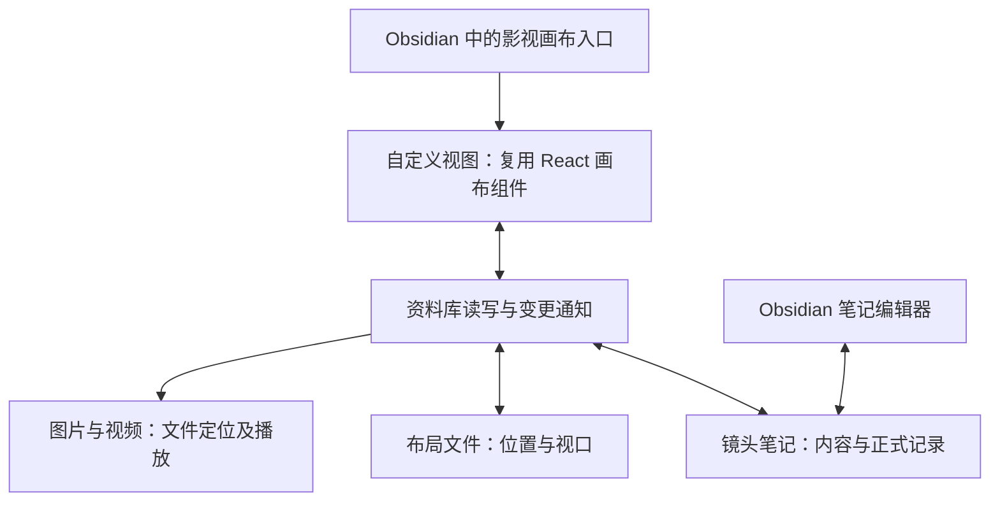

# 画布与 Obsidian 接入设计

状态：P0-A／P0-B／P0-C 与 [P1 选片](validation/p1.md) 已在隔离 Obsidian 1.13.7 实例中通过验收。见 [笔记](validation/p0-a.md)、[画布](validation/p0-b.md)、[素材](validation/p0-c.md) 及 [源码复用记录](source-reuse.md)。

实施目录固定为 `/Users/aliceboy/项目文件/闲来无事/obcanvas-creator`。从原画布选取的源码复制到本仓库后再适配；具体文件落点和先后顺序见 [开发计划](development-plan.md)。

## 接入决定

在 ObCanvas Creator 仓库中开发桌面版 Obsidian 插件，以自定义视图承载现有画布的 React 组件。插件直接读写当前 Obsidian 资料库中的项目文件。用户从中文入口打开画布，在同一个 Obsidian 窗口内整理镜头、查看素材和编辑笔记。

这是基于源码依赖情况的实施选择。Obsidian 官方提供了在 `ItemView.contentEl` 内挂载 React，并在视图关闭时卸载的方法：[React 接入说明](https://docs.obsidian.md/Plugins/Getting%20started/Use%20React%20in%20your%20plugin)。

这里的“画布”指既有 Infinite Canvas 项目的交互界面。P0 使用独立插件视图，不依赖 Obsidian 核心 Canvas 的内部实现，也不承诺本项目布局可直接作为原生 `.canvas` 文件编辑。



插件发布产物需要包含所用的前端资源，日常使用不以启动原画布的 Vite 服务或 Canvas Agent 为前提。浏览器版本与 Obsidian 版本目前拥有各自的数据来源；历史画布的选择性导入属于后续事项，不在 P0 自动同步或迁移。

## 现有代码说明了什么

以下是最初核对的本机来源 `/Users/aliceboy/项目文件/画布` 快照。实际引入的文件、校验值、目标路径和适配内容以 [复用记录](source-reuse.md) 为准，其他来源文件未整体导入。

| 来源 | 当前事实 | 接入处理 |
| --- | --- | --- |
| `web/src/components/canvas/infinite-canvas.tsx` | 256 行，包含平移、缩放和背景；依赖主题 store，并使用全局窗口事件和 body 光标 | 优先复用；适配主题、视图焦点与事件归属 |
| `web/src/components/canvas/canvas-connections.tsx`、`web/src/lib/canvas/canvas-node-geometry.ts` | 连线绘制与几何计算相对独立 | 首个切片需要时引入 |
| `web/src/components/canvas/canvas-node.tsx` | 896 行，节点交互与渲染还引用资源提示、插件节点等能力 | 按需提取卡片交互及文本／图片／视频显示，不默认复制全部依赖 |
| `web/src/pages/canvas/project.tsx` | 3267 行，直接导入路由、生成接口、RunningHub、Agent、素材库和配置 store | 作为交互参考，不作为插件挂载入口 |
| `web/src/stores/canvas/use-canvas-store.ts` | 通过 localforage 持久化整组项目，包含节点、连线和对话等数据，延迟保存 400ms | 为新插件建立资料库记录读写；不直接沿用整库浏览器持久化 |
| `web/src/services/file-storage.ts` | 媒体 Blob 保存在浏览器中，播放地址由运行时创建 | 改用文件记录与运行时地址解析；永久记录中保存路径及稳定 ID |
| `web/src/main.tsx`、`web/src/components/layout/app-providers.tsx`、`web/src/styles/globals.css` | 含网页启动、全局样式、页面标题、HTML 主题等行为 | 使用插件入口；样式限定在画布根节点，不整体导入网页启动环境 |
| `plugins/dsh/dsh-plugin-canvas-web/README.md` | 既有嵌入通过 iframe 加载本地网页并连接 Agent | 可以参考宿主入口体验，但它没有解决 Obsidian 资料库读写 |

代码行数仅描述本次核对的工作区快照，不是后续复用范围或工作量承诺。

## 三个必要的接入部分

### 1. 宿主与显示

- 插件注册“影视画布”视图及中文打开入口，通过 React 渲染组件。
- 首轮复用画布背景、平移缩放和需要的卡片交互。镜头卡通过稳定 ID 引用镜头笔记。
- 主题沿用原画布视觉语言，并跟随 Obsidian 明暗主题；只修改画布根容器。初期不引入全局 Tailwind reset 或网页 AppProviders。
- 快捷键仅在当前画布获得焦点且用户没有输入文字时生效；拖动监听归属当前视图所在窗口。关闭视图后移除事件和播放器资源。
- 多个标签页必须各自维护视口与选中状态；正式记录通过资料库变更通知更新。

Obsidian 的组件生命周期 API 可用于管理事件和释放资源，具体卸载行为仍需在插件内验证：[生命周期说明](https://docs.obsidian.md/plugins/guides/lifecycle-management)。

### 2. 资料库读写

以下是设计阶段的目录示意。实际实现将场次／镜头笔记和布局文件放在 `影视项目/`，素材可位于当前资料库任何可见目录。正式字段见 [记录格式](record-format.md)，由插件创建，用户不需要手写。

```text
接入测试/
├── 场次.md                # 稳定场次 ID、标题、镜头顺序
├── 镜头/
│   └── 镜头001.md         # 稳定镜头 ID、场次 ID、内容与素材关联
├── 素材/
│   ├── 参考图.png
│   └── 候选视频.mp4
└── 画布布局.json          # 节点与记录的映射、位置、尺寸、视口
```

- 镜头笔记是内容的正式来源；布局 JSON 不再复制镜头正文或采用决定。P0 不实现多版本采用流程；D06 起在同一镜头笔记中保存各视频关联的决定。
- 优先通过 Vault API 操作可见项目文件。更改现有正文时基于当前内容做受控更新；属性更新实际使用成熟的 `yaml` 库保留注释和未知字段，再通过 `Vault.process()` 原子更新单个笔记，不自己编写 YAML 解析器。
- 监听创建、修改、重命名和删除事件，按稳定 ID 刷新路径与视图。删除记录时显示缺失并保留可恢复的界面信息，不能用旧缓存将文件自动建回来。
- 保存提示必须等写入成功后显示“已保存”；失败保留未保存内容并允许重试。用户或 Agent 已修改同一字段时提示冲突，不能用旧表单覆盖。
- 初期避免一个用户操作必须同时改写多个正式文件；采用等复杂关系在 P1 明确其保存方式。

官方推荐用 `Vault.process()` 对当前正文执行读改写；异步处理时仍需检查内容是否已经改变：[Vault 读写说明](https://docs.obsidian.md/Plugins/Vault)。公开 API 还提供 `FileManager.processFrontMatter()`；这些方法不能代替应用对过期表单的冲突判断：[官方 API 定义](https://github.com/obsidianmd/obsidian-api/blob/master/obsidian.d.ts)。

### 3. 图片与视频

- 第一轮使用测试资料库内的一张图和一段短视频。读取 `TFile` 并通过 `vault.getResourcePath()` 获取当前可播放／显示地址；笔记中只登记稳定身份和资料库相对路径。
- 可复用已有的图片比例与视频节点呈现，但不复用浏览器 Blob 库作为正式存储。
- 读取不到时显示“素材缺失”或“无法播放”。尺寸、时长解析失败时保留未知，不能把原代码的默认尺寸当作实测值。
- 真实项目的外置硬盘关联需要独立验证文件访问、重新定位与离线提示。资料库内播放通过，不代表外部路径也已支持。
- 原始文件不移动、不覆盖。P0 不接远程生成，也不实现截图和采用区间。

`getResourcePath()` 的公开定义返回供浏览器引擎使用的资源 URI；具体视频编码能否播放需要实机测试：[官方 API 定义](https://github.com/obsidianmd/obsidian-api/blob/master/obsidian.d.ts)。

## P0 的实施顺序与验收

| 顺序 | 最小产出 | 通过条件 |
| --- | --- | --- |
| P0-A | 独立插件入口、中文视图、一张镜头笔记 | 在视图修改标题／内容后笔记更新；在笔记修改后视图更新；保存失败不显示成功 |
| P0-B | 复用的画布表面和镜头卡、布局保存 | 平移、缩放、移动镜头卡后重开恢复；旁边笔记输入空格及使用快捷键不受影响 |
| P0-C | 一张参考图、一段库内短视频与镜头的关联 | 图像比例正确、视频可播；重开仍能定位素材；重命名或缺失时反馈准确 |

最终连贯检查：在 Obsidian 点击“影视画布” → 编辑一张镜头卡 → 查看对应笔记 → 加入测试参考图和视频 → 移动卡片 → 关闭并重开视图及 Obsidian → 核对内容、布局和素材仍对应。再检查两个视图编辑同一记录时不会静默覆盖。

P0 已全部通过，P1 的排序和选片也已完成，详见 [总计划](plan.md) 中 P1 的三个镜头、多候选和采用状态验收。不能将显示一个空画布称为已完成打通。

## 已确认与待验证

- 已确认：原画布为 React 应用；部分显示组件可单独分析；浏览器存储与宿主全局行为需要适配；官方公开 API 提供接入所需基础能力。
- 本机 `/Applications/Obsidian.app` 的安装包元信息显示版本 `1.11.5`。这不是对当前自动更新后的运行时版本或插件兼容性的验收，实施时仍需读取运行时版本。
- 本机存在已登记且可访问的资料库；本设计不将其自动选为测试库，也未改动其中内容。
- 已验证：新插件构建、双向保存、保存失败、并发冲突、视图卸载与完整重启恢复。
- 已验证：复用后的明暗主题、相邻笔记输入、多标签视口隔离、布局恢复、PNG 显示及 H.264 MP4 播放、改名、缺失和重新关联。
- 待验证：外置素材访问、其他视频编码及独立弹出窗口；库内播放不代表这些场景已支持。
- 当前交付包含 P0 插件、隔离测试环境与所需源码复用；原画布业务代码和私人资料库配置未修改。
